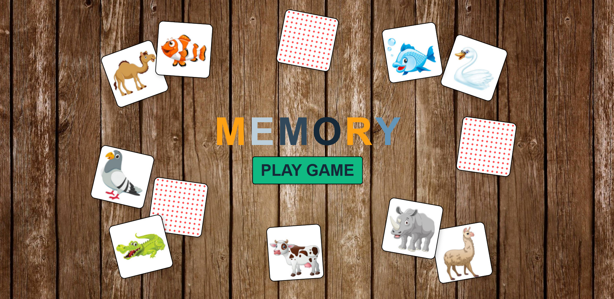

# Memory Game



## **Memory game**

The Memory Game is a fun and challenging puzzle game that tests your memory and attention to detail. The objective is to match pairs of cards by flipping them over one at a time. When you find a matching pair, both cards stay flipped. The goal is to match all pairs with the fewest number of attempts.

This digital version of the classic game offers a clean, engaging user interface with smooth animations and a variety of exciting features. You can play alone, challenge your memory, and track your progress as you advance through the game.

The project combines modern web development technologies to deliver an interactive experience that is both fun and educational.

## **Features**

- **Interactive Gameplay:** Flip cards to reveal matching pairs.
- **Card Shuffle:** Cards are shuffled before each game, ensuring a fresh challenge every time.
- **Animated Transitions:** Smooth card flipping and fade-in animations for a delightful experience.
- **Attempts Tracking:** Track how many attempts were made before finishing game.
- **Screen Resolutions:** Optimized for screens 1920\*1080px .

## **Technologies Used**

- **React**: For building the user interface.
- **Next JS**: For server-side rendering, providing faster initial page loads and SEO benefits.
- **TypeScript**: For type safety and better code maintainability.
- **React Context API**: For state sharing across components.
- **Tailwind**: For styling.
- **SCSS**: For enhanced CSS styling.
- **Framer motion**: For smooth animations like card flipping and transitions.
- **React.memo and useMemo**: Used to optimize performance by preventing unnecessary re-renders of components. React.memo is applied to memoize the CardComponentGame and useMemo is used for values that don't need to be recomputed on every render.
- **Express**: Used as the server framework for handling API routes and server-side logic.

## **Setup and Installation**

### Prerequisites

- Node.js installed on your system.
- Basic knowledge of npm.

1. Clone the repository:

   ```bash
   https://github.com/IvanPejcinoski1/MemoryGame.git

   ```

2. Navigate to the project directory: cd memory
3. Install dependencies: npm install
4. Start the development server:npm run dev
5. Start the server:node server.js
6. Visit http://localhost:3000 to play the game.
